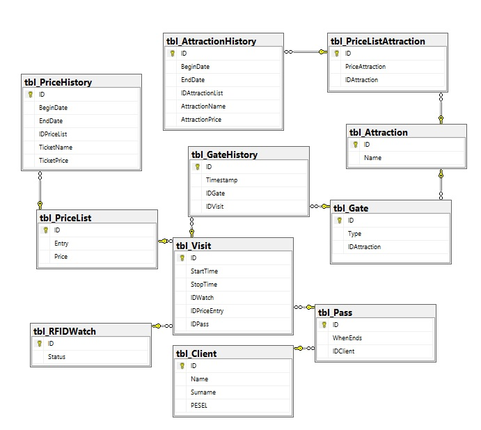
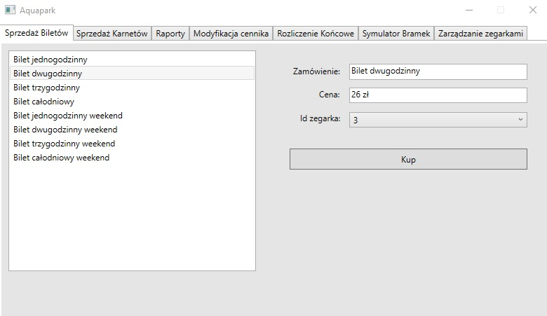
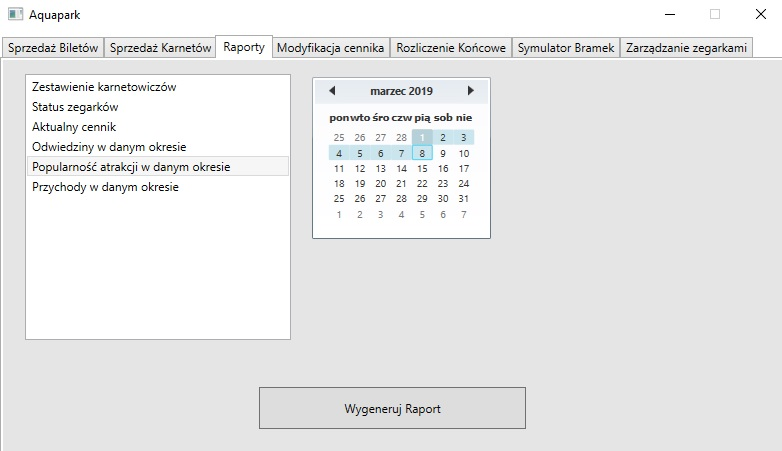
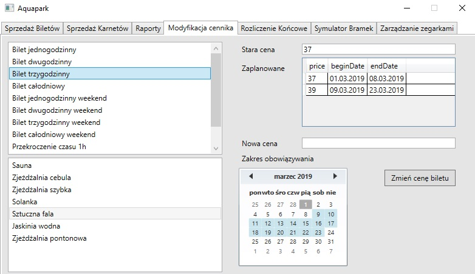
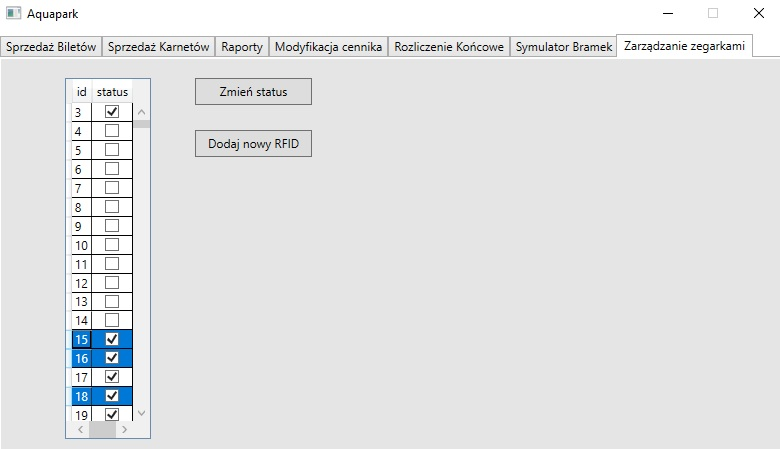

<h2>Aquapark - Projekt realizowany w ramach przedmiotu z baz danych.</h2>
<h3>Tematem projektu było zaprojektowanie bazy danych oraz napisanie aplikacji wspomagającej pracę aquaparku</h3>

Aplikacja została napisana przy współpracy z <a href="https://github.com/michalkubica">Michał Kubica</a>

Aplikacja zakładała sprzedaż biletów, karnetów, utrzymywanie cennika biletów, atrakcji z możliwością zmiany ich cen oraz czasu
obowiązywania. Rejestrowanie czasu korzystania z aquaparku, końcowe rozliczanie klienta uwzgledniające przekroczenie czasu na basenie
oraz możliwość dodawania/wyłączania zegarków RFID. Ponadto aplikacja zawierała plik pomocy dla użytkownika oraz możliwość generowania
raportów z wybranego okresu czasowego w formacie PDF.

Wykorzystane nardzędzia i technologie:

<ul>
  <li>C#</li>
  <li>LINQ to SQL</li>
  <li>Microsoft SQL Server</li>
</ul>

Poniżej schemat bazy danych:

Przykładowe zrzuty ekranu z działania aplikacji:

